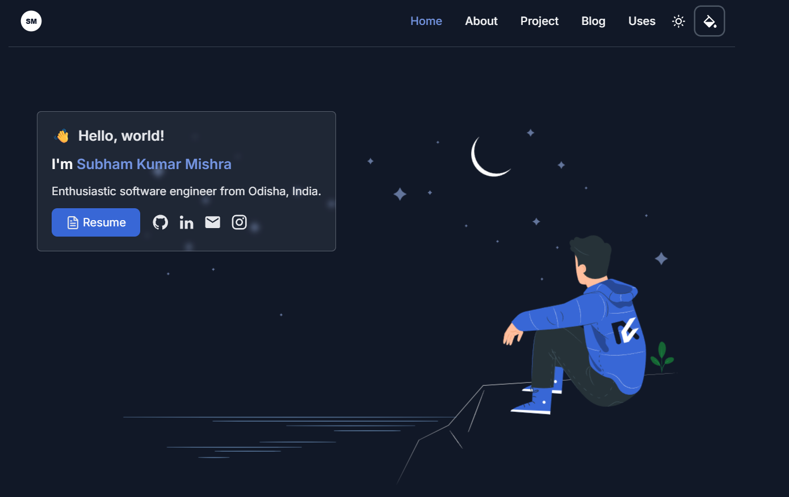

<picture>
  
</picture>

## Stack
- **Framework**: [Angular](https://angular.dev/)
- **Styling**: [Tailwind CSS](https://tailwindcss.com/)
- **Deployment**: [AWS S3](https://aws.amazon.com/s3/)

## Features 📋
⚡️ Navbar Glassmorphism\
⚡️ Toolbar Color Theme Selector\
⚡️ Light and Dark Mode\
⚡️ Spotlight Glow Hover Card\
⚡️ Devicon with Tooltip\
⚡️ Trakt Watch API

## Sections 📚
✔️ Intro Image\
✔️ Expertise Area\
✔️ Languages and Tools\
✔️ In my work\
✔️ About\
✔️ Projects\
✔️ Uses


## Running Locally

This application requires Node.js v18.13+.

```bash
npm install -g @angular/cli
git clone https://github.com/Subham192002/SubhamPortfolio.git
npm install
```

Wait to compile and go to http://localhost:4200 after compile finish

